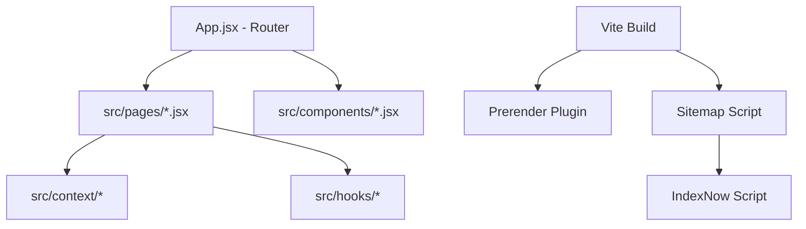

# 🗺️ SYSTEM_MAP (시스템 지도)

## 🏗️ 전체 아키텍처
본 프로젝트는 **Vite + React (v19)**를 기반으로 하는 단일 페이지 애플리케이션(SPA)입니다. 130개 이상의 독립적인 유틸리티 도구들을 제공하며, SEO 최적화를 위해 빌드 시점에 프리렌더링 및 사이트맵 생성을 수행합니다.

## 🛠️ 기술 스택 (Tech Stack)
- **Core**: React 19, Vite 7
- **Styling**: Tailwind CSS 4, PostCSS
- **Routing**: React Router Dom 7
- **SEO**: React Helmet Async, Vite Plugin Prerender, IndexNow
- **Utilities**:
  - `lunar-javascript`: 음력 및 사주 분석
  - `matter-js`: 물리 엔진 기반 게임/도구
  - `qrcode`, `jsbarcode`: 코드 생성
  - `marked`: 마크다운 렌더링
  - `colorthief`: 이미지 색상 추출

## 📂 폴더 구조 및 역할
- `src/`: 소스 코드 핵심부
  - `pages/`: 138개의 개별 도구 페이지 (Main Logic)
  - `components/`: 재사용 가능한 UI 컴포넌트
  - `context/`: 전역 상태 관리
  - `hooks/`: 커스텀 리액트 훅
  - `locales/`: 다국어 지원 (i18n)
- `scripts/`: 빌드 및 운영 보조 스크립트
  - `generate-sitemap.js`: 사이트맵 자동 생성
  - `submit-indexnow.js`: 검색 엔진 인덱싱 요청
  - `copy-404.js`: Vercel/SPA 배포용 404 페이지 복사
- `public/`: 정적 자산 및 검색 엔진 인증 파일

## 🧩 컴포넌트 구조도

## 🔑 외부 연동
- **IndexNow API**: `bbd0d9a6843c450eb3e9d811a0fd504a`
- **Domain**: `https://tool.lego-sia.com`
